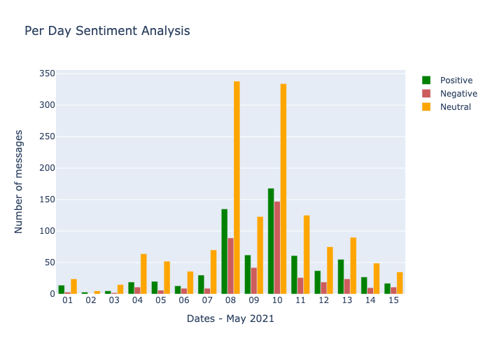

# Install all the requirements:

pip3 install -r requirements.txt

# Run the code:

python3 ISI_Spring2022.py 

# Documentation on Code:

## Steps:
### Importing necessary libraries
### Load the Telegram data in JSON
### Extract only the messages component of data
### Convert JSON messages into pandas DataFrame
### Replace emojis by demojizing them and adding their meaning to the text.
### Drop unnecessary features like ids of message, fromPerson, toPerson etc.
### Definition of the following function:
#### isEnglish() function takes into a string/text/message and returns true if it is in English and False otherwise (Made use of detect from langid library )
#### filterOnLetters() function return True if the text/message/string contains "SHIB" or "DOGE", returns False otherwise

### Drop all the non english text rows from dataframe using isEnglish function defined above
### Apply filterOnLetters function on the text column of our dataframe, dropping all the rows whose text doesn't contain "SHIB" or "DOGE"
### Use TextBlob lexicon to calculate the sentiment score of each message and further categorizing each message into "positive", "negative" and "neutral" according to the scores assigned by TextBlob
### Use Afinn lexicon to calculate the sentiment score of each message and further categorizing each message into "positive", "negative" and "neutral" according to the scores assigned by Afinn
### Use Vader lexicon to calculate the sentiment score of each message and further categorizing each message into "positive", "negative" and "neutral" according to the scores assigned by Vader
#### Above three lexicons are used in order to first compare which will suit better to our dataset.
### Adding one more row to our dataset categorizing each message to know if it contains only "DOGE" or only "SHIB" or both.
### Comparison of Afinn, TextBlob and Vader
### Plots and Analysis

# Observations:
### Initially, we had 49436 rows/messages in our dataframe originally taken from telegram
### After removing non-english sentences, we had 40388 messages left with us in the dataframe
### Further, on applying the "DOGE" and "SHIB" filter on the dataFrame, we are left with only around 2500 messages
### Most positive sentiment according to Afinn doesn't really seem like a positive message as the user is disappointed with the SHIB coin.
### Most negative sentiment according to Afinn doesn't really sound like a negative message as the user is being neutral
### While looking at most positive and most negative messages by TextBlob, Afinn and Vader, we observe that Vader is indeed actually better scoring the text in terms of sentiments.
### Number of messages increase suddenly on 8th and decrease post 11th, this might be an indicator of price change in either "DOGE" or "SHIB" or both, as people start discussing more about these in the given date range
### In the date range [9-13], there are more positive sentiment messages in the group, which might be an indicator of people benefitting of "DOGE" or "SHIB"
### Further we can observe indiviudal sentiments of DOGE and SHIB from averageSentimentPerDayPlot-SHIB.png and averageSentimentPerDayPlot-DOGE.png plots.

